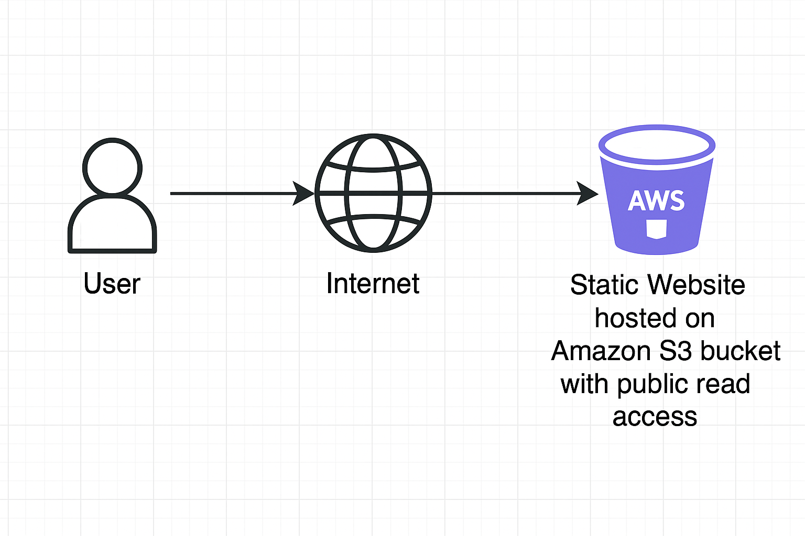

# 100DaysofAWS
My AWS learning journey — projects and labs.
# Day 1 - Static Website Hosting on AWS S3

This project demonstrates hosting a static HTML website using Amazon S3.

## What I did:
- Created an S3 bucket with public access for static site hosting.
- Uploaded `index.html` as the website content.
- Enabled static website hosting from S3 bucket properties.
- Added a bucket policy for public read access.
- Accessed the website via the provided S3 endpoint URL.

## Live website link
http://kanika-day1-static-site.s3-website-ap-southeast-2.amazonaws.com/

## Architecture Diagram

